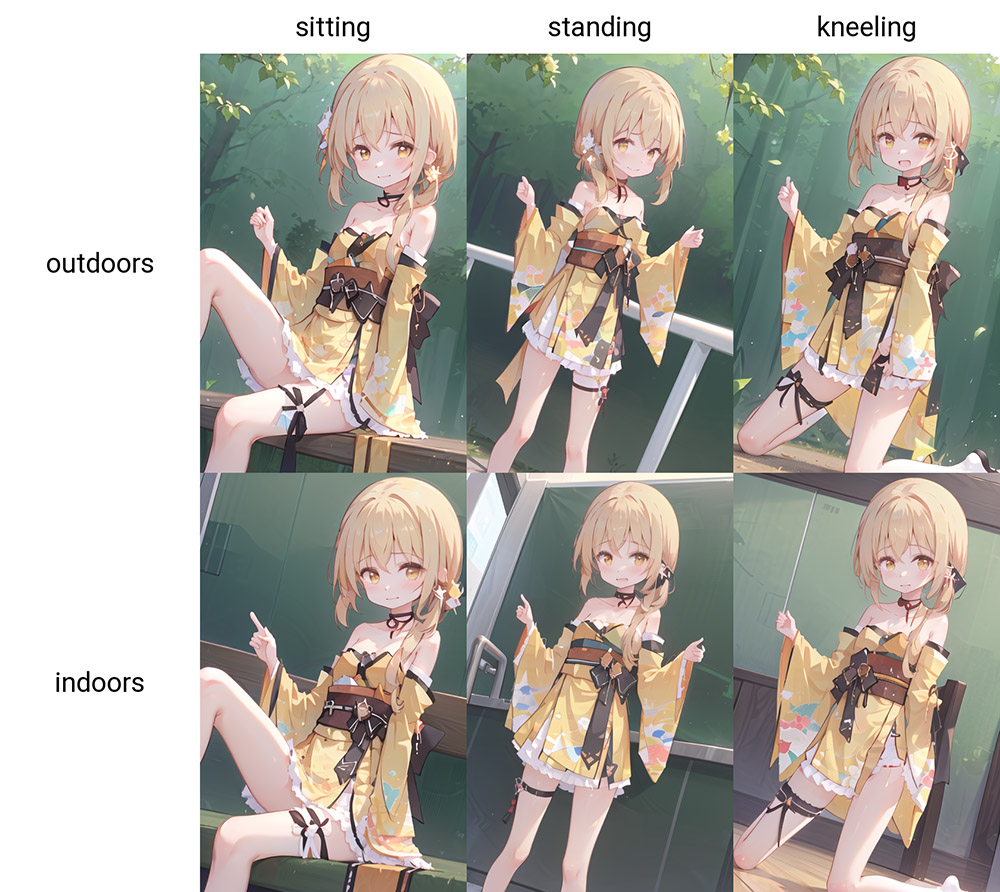
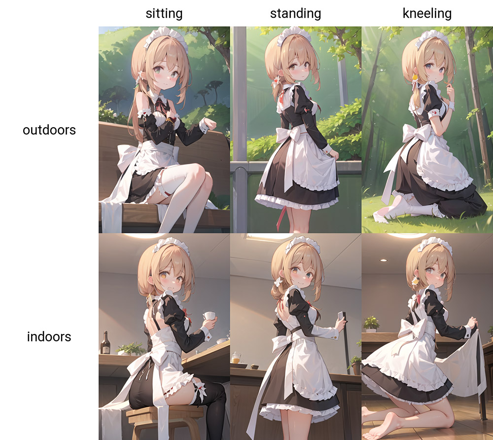
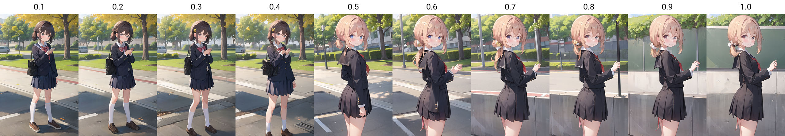
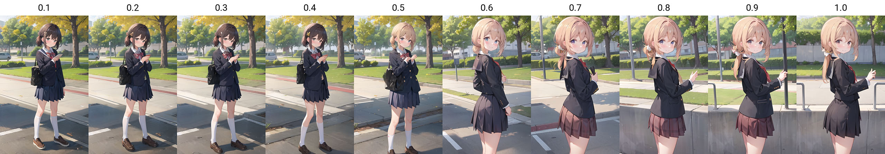

# 【rimochan-LORA】量产型电子莉沫酱！


大家有用过Stable Diffusion吗？Stable Diffusion是1个生成图像的模型，嗯……感觉介绍很麻烦所以就不说了！

总之我训练了1个LORA，可以用在Stable Diffusion上，来生成量产型电子莉沫酱图像！


## 训练参数

因为原始训练集只有5张，做了1些裁剪放大和翻转之后增加到20张，感觉很容易过拟合。

然后我调整了这些参数，如果大家有类似的情况也可以参考我的参数: 

- network_dim: 10
    - 模型小1点，不容易过拟合。

- network_alpha: 2
    - 虽然我看其他LORA喜欢开到network_dim的1半，但我测试下来alpha只要超过3，就会导致泛化性明显下降。

- batch_size: 2
    - 我的1080Ti最大只能开2……

- max_train_steps: 1000
    - 因为数据太少，所以就少炼1会吧。

- optimizer: LION
    - 感觉挑来挑去都差不多，相信新就是好吧！

- lr:
    - text_encoder: 2e-05
    - unet_lr: 5e-05
    - 据说LION的学习率应该设为AdamW的1/3，但是我怕过拟合就又往回调了些。

- lr_scheduler: cosine_with_restarts
    - 我的直觉是它没有比cosine好，但是网上的人说好那就用吧。


## 效果

### 普通样例



看起来不错！

参数: 

```txt
1girl, solo,
sitting, blush, outdoors,
(japanese clothes, kimono, print kimono, yellow kimono, yellow sleeves, strapless dress, dress, choker, obi, sash, detached sleeves: 0.8),
<lora:rimochan:1>
Negative prompt: (worst quality, low quality:1.4), (realistic, lip, nose, tooth, rouge, lipstick, eyeshadow:1.0), (abs, muscular, rib:1.0), (blurry, greyscale, monochrome:1.0), text, title, logo, signature
Steps: 50, Sampler: DPM++ 2M Karras, CFG scale: 7, Seed: 1, Size: 448x704, Model hash: 7d7b896083, Model: Counterfeit-V2.2, Script: X/Y/Z plot, X Type: Prompt S/R, X Values: "sitting, standing, kneeling", Y Type: Prompt S/R, Y Values: "outdoors, indoors"
```

### 换衣服样例

我也测试了1下模型的泛化性，换上女仆装！



看起来也不错！

参数: 

```
1girl, solo,
sitting, blush, outdoors,
maid, maid headdress,
<lora:rimochan:1>
Negative prompt: (worst quality, low quality:1.4), (realistic, lip, nose, tooth, rouge, lipstick, eyeshadow:1.0), (abs, muscular, rib:1.0), (blurry, greyscale, monochrome:1.0), text, title, logo, signature
Steps: 50, Sampler: DPM++ 2M Karras, CFG scale: 7, Seed: 1, Size: 448x704, Model hash: 7d7b896083, Model: Counterfeit-V2.2, Script: X/Y/Z plot, X Type: Prompt S/R, X Values: "sitting, standing, kneeling", Y Type: Prompt S/R, Y Values: "outdoors, indoors"
```

### 权重调整样例

随着LORA权重增加，输出图片的变化:



参数:

```
1girl, solo,
standing, blush, outdoors, school,
<lora:rimochan:0.1>
Negative prompt: (worst quality, low quality:1.4), (realistic, lip, nose, tooth, rouge, lipstick, eyeshadow:1.0), (abs, muscular, rib:1.0), (blurry, greyscale, monochrome:1.0), text, title, logo, signature
Steps: 40, Sampler: DPM++ 2M Karras, CFG scale: 7, Seed: 1, Size: 448x704, Model hash: 7d7b896083, Model: Counterfeit-V2.2, Script: X/Y/Z plot, X Type: Prompt S/R, X Values: "0.1,0.2,0.3,0.4,0.5,0.6,0.7,0.8,0.9,1.0"
```

我们观察到莉沫酱LORA会使模型倾向于画出简单的背景，这是因为训练集的关系。可以考虑使用[lora-block-weight](https://github.com/hako-mikan/sd-webui-lora-block-weight)插件，降低几个特定层的权重来缓解这个问题。

比如将权重设为`<lora:rimochan:1:1,1,1,1,1,0.8,0.2,1,1,1,1,1,1,1,1,1,1>`，输出的图片是这样: 



## 结束

就这样，我要去当人工智能科学家了，大家88！
