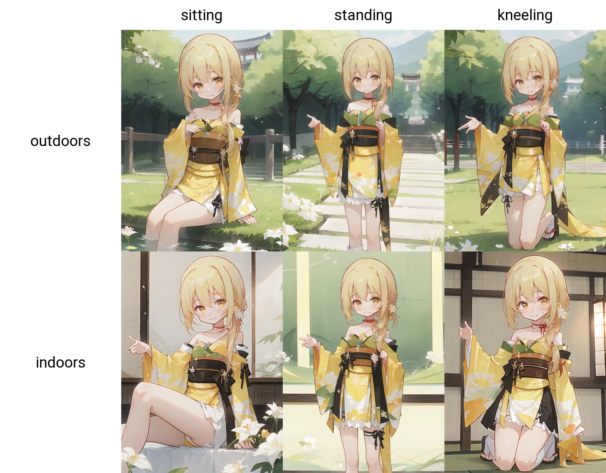
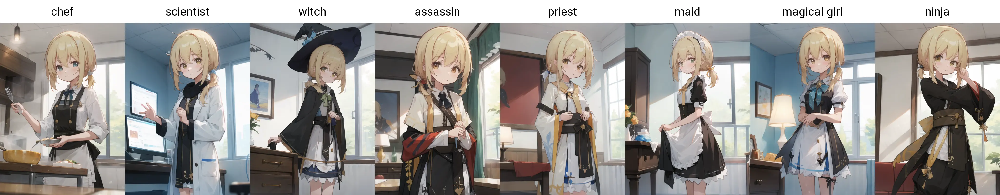
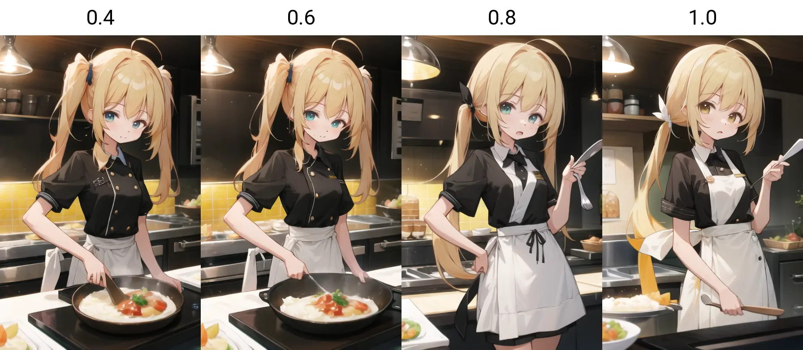

# 【rimochan-LORA】量产型电子莉沫酱！


大家有用过Stable Diffusion吗？Stable Diffusion是1个生成图像的模型，嗯……感觉介绍很麻烦所以就不说了！

总之我训练了1个LORA，可以用在Stable Diffusion上，来生成量产型电子莉沫酱图像！


## txt2img样例



看起来很像莉沫酱！

但其实是因为模型是挑过的，虽然训练的时候是在novel_ai的模型上训的，但是测试下来发现Counterfeit-V3.0的效果最好，就用它的结果来做样例了。

使用的Prompt为:

```
rimochan,
blush, 什么姿势, 室内还是室外,
japanese clothes, kimono, print kimono, yellow kimono, yellow sleeves, strapless dress, dress, choker, obi, sash, detached sleeves
```


完整的参数为: 

```txt
rimochan,
blush, sitting, outdoors,
japanese clothes, kimono, print kimono, yellow kimono, yellow sleeves, strapless dress, dress, choker, obi, sash, detached sleeves,
<lora:rimochan_v2:1>
Negative prompt: (worst quality, low quality:1.4), (realistic, lip, nose, tooth, rouge, lipstick, eyeshadow:1.0), (abs, muscular, rib:1.0), (blurry, greyscale, monochrome:1.0), text, title, logo, signature
Steps: 50, Sampler: DPM++ 2M SDE Karras, CFG scale: 7, Seed: 1, Size: 512x704, Model hash: cbfba64e66, Model: Counterfeit-V3.0_fp16, VAE hash: ab33ad55c6, VAE: Counterfeit-V2.5.vae.pt, Lora hashes: "rimochan_v2: 135809c2d542", Eta: 0.68, Script: X/Y/Z plot, X Type: Prompt S/R, X Values: "sitting, standing, kneeling", Y Type: Prompt S/R, Y Values: "outdoors, indoors", Version: v1.6.0
```

## 换衣服样例

我也测试了1下模型的泛化性，给莉沫酱换上各种衣服试试吧！



看起来都很可爱，好耶！

使用的Prompt为:

```
rimochan, 穿什么衣服, indoors
```

完整的参数为: 

```
rimochan, chef, indoors,
<lora:rimochan_v2:1>
Negative prompt: (worst quality, low quality:1.4), (realistic, lip, nose, tooth, rouge, lipstick, eyeshadow:1.0), (abs, muscular, rib:1.0), (blurry, greyscale, monochrome:1.0), text, title, logo, signature
Steps: 50, Sampler: DPM++ 2M SDE Karras, CFG scale: 7, Seed: 1, Size: 512x704, Model hash: cbfba64e66, Model: Counterfeit-V3.0_fp16, VAE hash: ab33ad55c6, VAE: Counterfeit-V2.5.vae.pt, Lora hashes: "rimochan_v2: 135809c2d542", Eta: 0.68, Script: X/Y/Z plot, X Type: Prompt S/R, X Values: "chef,scientist,witch,assassin,priest,maid,magical girl,ninja", Version: v1.6.0
```

## 关于模型版本和Prompt

v1是比较早训的，原始训练集只有5张，做了1些裁剪放大和翻转之后增加到20张，效果也不错，不过有一些奇怪的问题。

v2版本的模型加了几张新莉沫酱图，以及我弄了一些画师酱的杂图掺在数据集里做扩充。扩充部分的Prompt不带有`rimochan`，因此生成时Prompt需要加上`rimochan`才能稳定生成莉沫酱图片。

这个Prompt不是只是给人添麻烦的，它有用的地方是可以降低lora的刻板印象。像是v1版本的lora不能换发型，即使指定了`twintails`，模型还是会生成`low ponytail`的莉沫酱，而v2只要降低Prompt中`rimochan`的权重就可以让模型顺利生成`twintails`了，就像这样——



降权后眼睛的颜色好像不是很对，没事，遇到这种情况就手动调整一下吧！


使用的Prompt为:

```
(rimochan:权重), twintails, chef
```

完整的参数为: 

```
(rimochan:0.4), twintails, chef
<lora:rimochan_v2:1>
Negative prompt: (worst quality, low quality:1.4), (realistic, lip, nose, tooth, rouge, lipstick, eyeshadow:1.0), (abs, muscular, rib:1.0), (blurry, greyscale, monochrome:1.0), text, title, logo, signature
Steps: 50, Sampler: DPM++ 2M Karras, CFG scale: 7, Seed: 1, Size: 448x704, Model hash: cbfba64e66, Model: Counterfeit-V3.0_fp16, VAE hash: ab33ad55c6, VAE: Counterfeit-V2.5.vae.pt, Lora hashes: "rimochan_v2: 135809c2d542", Script: X/Y/Z plot, X Type: Prompt S/R, X Values: "0.4,0.6,0.8,1.0", Version: v1.6.0
```

## 结束

就这样，我要去当人工智能科学家了，大家88！
